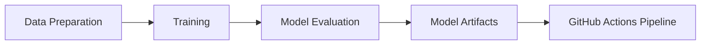

# ML Model Training Pipeline


This repository contains the complete implementation of a simple Convolutional Neural Network (CNN) for MNIST digit classification with a complete CI/CD pipeline using GitHub Actions.  

## Project Architecture


## Model Architecture
- Model Type: CNN
- First Conv Layer : 1 in_channel, 4 out_channel, 3x3 kernels, padding=1
- Second Conv Layer : 6 channels, 3x3 kernels, padding=1
- Maxpooling Layer that reduces the dimesnion to 7x7x8
- First Fully Connected Layer : 392 --> 16
- Second Fully Connected Layer : 16 --> 10
- ReLU activations are used throughout
  
## Requirements
```txt
torch>=2.0.0
torchvision>=0.15.0
numpy>=1.24.0
pandas>=2.0.0
scikit-learn>=1.2.0
matplotlib>=3.7.0
```

## Setup and Installation
1. Clone the repository
```bash
git clone [your-repo-url]
cd [repo-name]
```

2. Install dependencies
```bash
pip install -r requirements.txt
```

## Training
Run the training script:
```bash
python src/train.py
```

Training parameters can be configured in `config.yaml`:
- Batch size: 32
- Learning rate: 0.001
- Epochs: 10

## Testing
Execute tests:
```bash
python src/test.py
```

## GitHub Actions Pipeline

The ML pipeline is automated using GitHub Actions and consists of the following steps:

1. **Setup Environment**
   - Checkout code
   - Setup Python
   - Install dependencies

2. **Training**
   - Load and preprocess data
   - Train model
   - Save model artifacts

3. **Testing**
   - Run unit tests
   - Validate model performance
   - Generate metrics

4. **Artifact Management**
   - Save trained model
   - Store evaluation metrics
   - Upload artifacts

### Pipeline Workflow
```yaml
name: ML Training Pipeline
on: [push]

jobs:
  train:
    runs-on: ubuntu-latest
    steps:
      - uses: actions/checkout@v4
      - name: Set up Python
        uses: actions/setup-python@v4
      - name: Install dependencies
        run: pip install -r requirements.txt
      - name: Train model
        run: python src/train.py
      - name: Test model
        run: python src/test.py
```

## Project Structure
```
├── .github/
│   └── workflows/
│       └── ml-pipeline.yml
├── src/
│   ├── train.py
│   ├── test.py
│   └── utils.py
├── data/
│   ├── raw/
│   └── processed/
├── models/
│   └── saved_models/
├── config.yaml
├── requirements.txt
└── README.md
```
